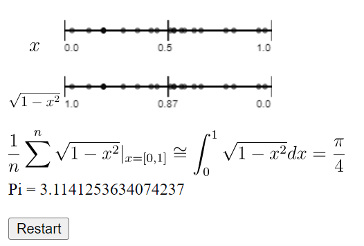
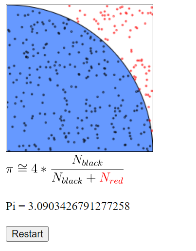

# Monte-Carlo-estimation-of-Pi

In this repo I'll use two monte Carlo method:  
- average value method  
<kbd></kbd>  
👉[demo website](https://hsushihhsueh.github.io/Monte-Carlo-estimation-of-Pi/monte_carlo_average.html)  
- area method  
<kbd></kbd>    
👉[demo website](https://hsushihhsueh.github.io/Monte-Carlo-estimation-of-Pi/monte_carlo_area.html)  

to estimation of Pi by different programming lauguage:  
- [go](monte_carlo.go) ([parallel](monte_carlo_parallel.go))
- [python](monte_carlo.py)
- [C++](monte_carlo.cpp)
- javascript: ([average](monte_carlo_average.html)) ([area](monte_carlo_area.html))

and  
- compare the performance between two method. ([result](monte_carlo_comparison.ipynb))

## Refence
- [Monte Carlo estimates of pi and an important statistical lesson](https://blogs.sas.com/content/iml/2016/03/14/monte-carlo-estimates-of-pi.html)
